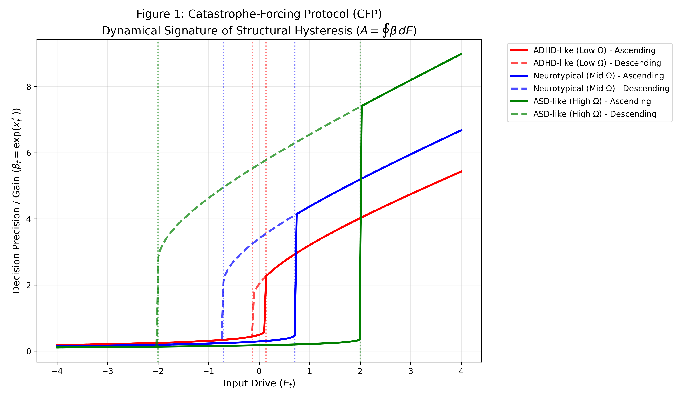

\# Dysregulation of Adaptive Gain Control in Reinforcement Learning

\### A Computational Account of ADHD and ASD Phenotypes


!\[Python](https://img.shields.io/badge/Python-3.8%2B-blue)

!\[License](https://img.shields.io/badge/License-MIT-green)

!\[Status](https://img.shields.io/badge/Status-Prototype-orange)


\*\*Author:\*\* Aruma Harada (High School Researcher)  

\*\*Target:\*\* JSEC 2025 / Computational Psychiatry


---


\## 📌 Overview

We propose the \*\*Thermostatic Gain Control (TGC)\*\* model, a biologically-inspired reinforcement learning framework that dynamically modulates the exploration-exploitation balance (Inverse Temperature $\\tau$).


This repository contains the simulation code demonstrating that psychiatric phenotypes can be mapped to specific failures in gain control:

\* \*\*ADHD-like:\*\* Failure in Stabilization (High thermal inertia: $\\gamma \\to 1$).

\* \*\*ASD-like:\*\* Failure in Destabilization (High tolerance threshold: $\\theta \\to \\infty$).


<div align="center">

&nbsp; 

&nbsp; <br>

&nbsp; <em>Figure 1: Entropy dynamics in Probabilistic Reversal Learning. The ASD-like agent (Green) exhibits hyper-stability in static phases but fails to adapt to volatility.</em>

</div>


---


\## 🚀 Quick Start


\### 1. Installation

```bash

git clone \[https://github.com/YOUR\_USERNAME/TGC-Model.git](https://github.com/YOUR\_USERNAME/TGC-Model.git)

cd TGC-Model

pip install -r requirements.txt

